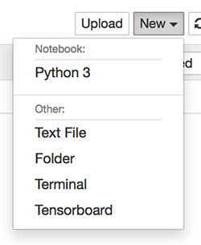

# Artificial Neural Networks

[](https://hub.docker.com/r/zifeo/artificial-neural-networks/)

Throughout the semester, we will use [Keras](https://keras.io) with its [Tensorflow](https://www.tensorflow.org) backend in pratical exercices and mini-projects. Due to the differences between platforms, we provide an all-in-one docker notebook image in two flavours. In case you own a [CUDA-enabled gpu](https://developer.nvidia.com/cuda-gpus) on GNU/Linux you can take advantage of the `gpu` version (see [ADVANCED.md](ADVANCED.md)), otherwise the `cpu` version will do the job.

Although we do not support it, you can as well create your own setup using local packages or [virtualenv](https://virtualenv.pypa.io/en/stable/). However your assignements should run fine with the same configuration and within this image:

- python==3.5
- Keras==2.1.4
- tensorflow==1.5.0 

## Getting started

[Docker](https://www.docker.com) provide operating-system-level virtualization, i.d. light and easy to use containers for running isolated software. First, you will need to install Docker CE (=community edition, make sure you do not install Docker EE):

- Mac: [instructions](https://docs.docker.com/docker-for-mac/install/) or [direct download](https://download.docker.com/mac/stable/Docker.dmg)
- Ubuntu: [instructions](https://docs.docker.com/install/linux/docker-ce/ubuntu/)
- Debian: [instructions](https://docs.docker.com/install/linux/docker-ce/debian/)
- Windows: [instructions](https://docs.docker.com/docker-for-windows/install/) or [direct download](https://download.docker.com/win/stable/Docker%20for%20Windows%20Installer.exe)

## CPU version

Once Docker is installed, open a shell (Terminal on Mac and Linux, Command Prompt on Windows) and test your setup.

```shell
docker run --rm zifeo/artificial-neural-networks:cpu python3 -c 'import keras; print(keras.__version__)'
```

It should output:

> Using TensorFlow backend.
>
> 2.1.4

Then, you can start the notebook server and access [localhost:8888](http://localhost:8888).

```shell
# start (explained, do not run)
docker run \
  --rm \ # the container will remove itself upon termination
  -d \ # the container will detach itself and run in background
  --name ann \ # you can access live logs with `docker logs ann -f`
  -p 8888:8888 \ # publish docker port to local one
  -v $(pwd):/jupyter \ # mount current directory to docker internal folder '/jupyter', on Windows replace $(pwd) by %cd% (for Command Prompt) or ${PWD} (for PowerShell)
  zifeo/artificial-neural-networks:cpu # name of the image we are using

# one-liner start
# Mac + GNU/Linux
docker run --rm -d --name ann -p 8888:8888 -v $(pwd):/jupyter zifeo/artificial-neural-networks:cpu 
# Windows (Command Prompt)
docker run --rm -d --name ann -p 8888:8888 -v %cd%:/jupyter zifeo/artificial-neural-networks:cpu 
# Windows (PowerShell)
docker run --rm -d --name ann -p 8888:8888 -v ${PWD}:/jupyter zifeo/artificial-neural-networks:cpu 

# stop after usage
docker stop ann
```

Be careful to use the volume mapping (`-v`) to a specified folder, otherwise your work will be destroyed when stopping the notebook server.

## Usage

Once you access [localhost:8888](http://localhost:8888), you should see the *files tab*. If you mapped your current directory with `-v`, you may already see files in there.


You can then easily create new notebooks using the *new menu*.



And check you have the expected Keras and Tensorflow version.


To sum up, here is a suggested workflow:

```shell
# navigate to your desired folder
cd CS-456

# start the notebook server ($(pwd) should be replaced by %cd% or ${PWD} on Windows)
docker run --rm -d --name ann -p 8888:8888 -v $(pwd):/jupyter zifeo/artificial-neural-networks:cpu 

# work on localhost:8888
# your files should be persisted in directory you navigated

# do not forgot to stop the notebook server at the end
docker stop ann
```

## Security notes

This image does not include any security mechanism and thus should not be used in a open environment (e.g. public server or untrusted network) without adequat protection.


